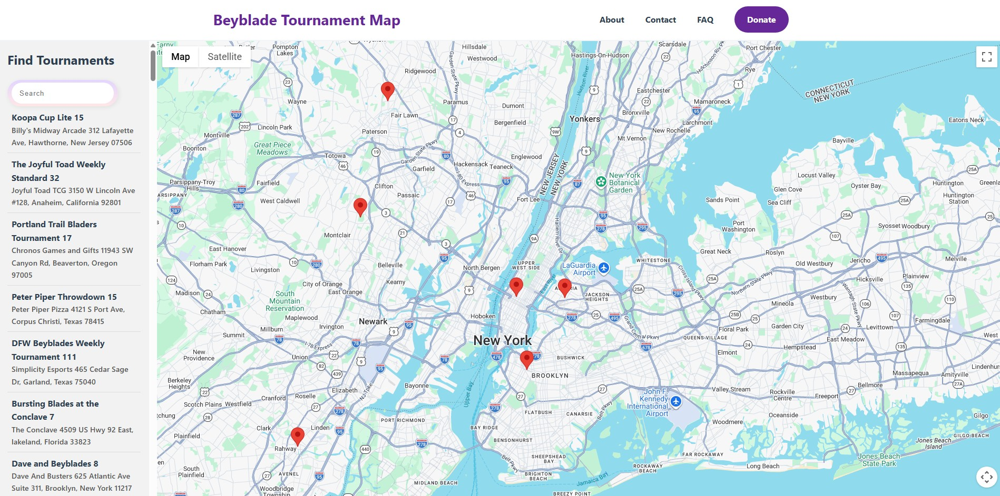

# beyblade_event_mapping

Google Map integration for visualizing upcoming Beyblade events posted on the WBO. **This is a closed project that runs locally, the goal is to ensure enough working features to release this on a public website for the community to utilize.** I appreciate all feedback that you have on the project at this time.

## Getting Started

- Clone this repository.
- Sign up for a trial API key from [Google Maps Platform](https://developers.google.com/maps/documentation/javascript/demo-key). You will need to input your CC info to get access to the Geocoding API.
- run `new_scraper.py` to get the latest data (replace the old file in `data/tournaments.json` with the new generated file).
- In Bash, run `cd data`, then `npx serve`.

## Known Issues

- You will encounter console errors when loading the page for the first time. This is a bug in the caching function I will fix soon. On reload, you can see all cached entries in the console. This is important as to limit API calls.
- Nav bar items are not functioning yet, more pages are soon to come.

## Coming Soon

- WBO page preview (to showcase community posters!)
- Nav bar pages
- Data analysis of regional metas
- Search by proximity
- Search by date

## Business Inquiries & Contributions

I am looking to potentially advertise beyblade related products and merchandise on this website. If you are a vendor that is interested or would like to collaborate on development, please reach out to me on any of my socials:

- Tiktok: crimsonstrike
- Instagram: crimsonstrike298
